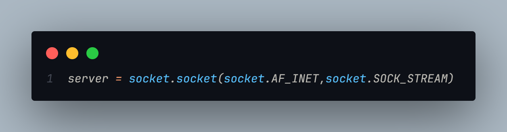
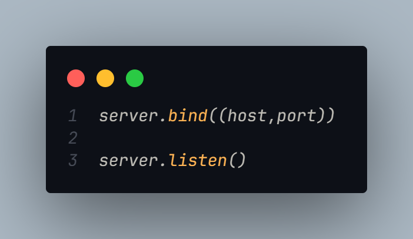
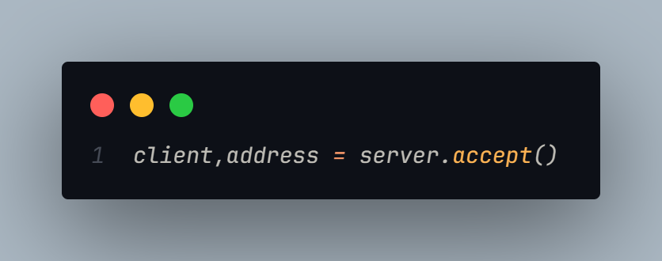
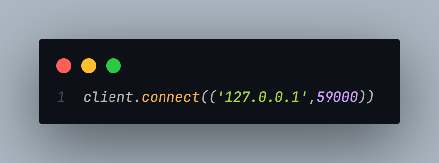
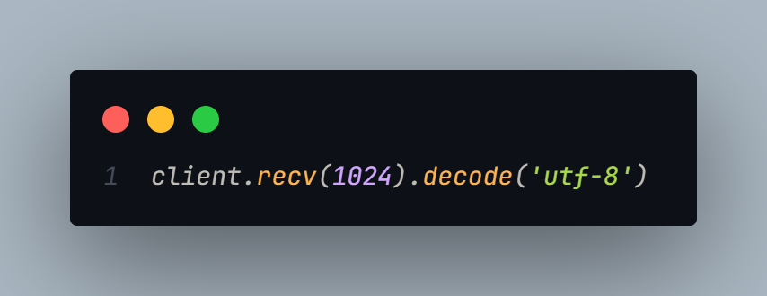
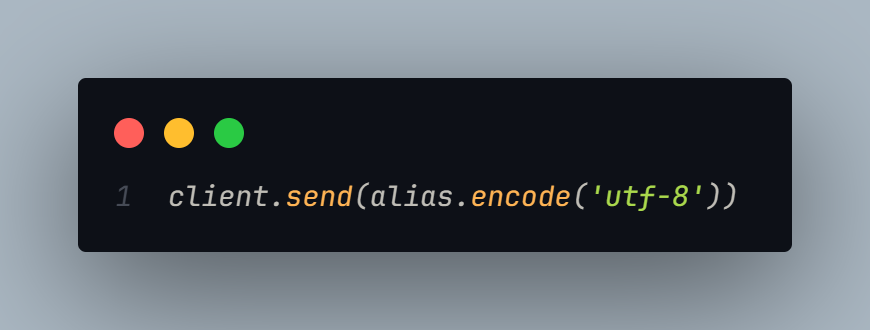
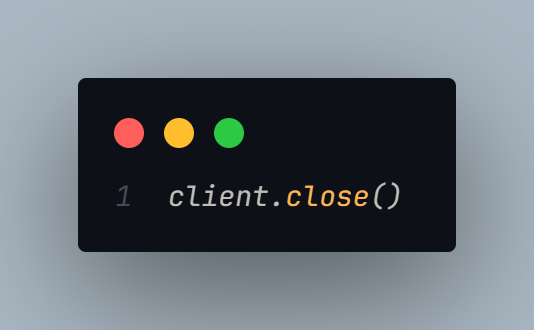
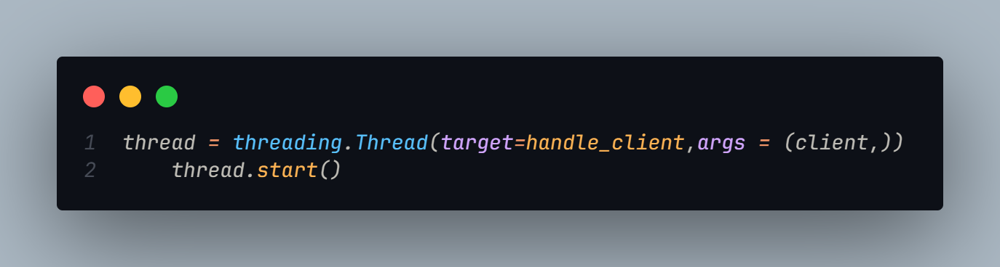

# Chatting Room simple project

## Intro:

I just want to say that I am no expert in documenting nor in networking nor in python, but it's more about interest and curiosity, and since I am a CS student, I want to highlight that in this project there are a lot of concepts that are taught in the university that it concretizes, for instances:

- Networking concepts like ports and sockets and IP addresses and protocols like TCP.
- Operating system concepts like multithreading.

And in this documentation I am only going to highlight these concepts as a way to encourage my self and my fellow students to focus in their studies because as they will see most of the topics are extremely relevant.

I hope you find this documentation useful, and let's jump into it.

In this minimalistic project that I applied from [this video](https://www.youtube.com/watch?v=SimNmTciQTs&list=PLwgdyX05RDqxJGVPcTiz0sUvS6uJzz6cQ&index=8) I tried to implement a chatting room demo to learn **Network programming** and guess what?! It's So much fun!!

Since I mentioned the source I think I don't need to go through the coding process but if you are not interested in watching the video then here are some key points:

## Sockets:

Sockets are the key point of this project, they are a way to link between nodes (end devices such as servers and clients in our example), you can read more about them in [here](https://www.geeksforgeeks.org/socket-in-computer-network/).

**_Server socket creation in python_**



**_Client socket creation in python_**


As you can see, it's the same process, but let's go through some technical details about this common line of code.

```py
socket.AF_INET
```

This line stands for **Address Family IPv4**.

```py
socket.SOCK_STREAM
```

This line it's specifies **what kind of socket this is**, and it says it's a **TCP socket**.

As you can see, the networking concepts mentioned in the intro are the backbone of sockets.

### What a socket can do:

If we go through the code we can see that socket job differs from the client and the server, lets start with the server side:





As you can see, the server (which we created the socket in) can **_bind, listen and accept_**

- **bind**: this means telling the socket which IP address to accept connection requests from and which port, IP specifies the machine and the port specifies the app or let's say the service.
- **listen**: this let's the **bind** server be in listening mode to any coming requests. You can specify how many connections the server can listen to between ().
- **accept**: this let's the **listening** server accepts connections, as you can see the `server.accept()` method returns to values, the address of the connected client (address), and a socket object that acts as a way to send and receive data from the client (client).

**_Key points_**:

- The server can bind,listen,accept.
- These actions must be done in order.
- When the server accepts a connection it can act as a **peer** and send and receive messages to and from the connected client.

Let's now see what a client can do (and remember the last key point):









As you can see, the client **_connects,sends,receives messages and closes connections_**.

Now to make this documentation useful, I will **not** go in detail about these functionalities, it is up for you to play with this project and discover new things.

## How to handle multiple clients:

This is a common problem in networking, it has a lot of solutions, and the one used in our code is **_multithreading_**, I will not be explaining what threads are in details because this will be studied in the 3rd year in a computer science full semester course, but basically a thread is a unit of code executes within a process addressing space (I hope that's correct :).

### How does this work:

We basically create a thread that handles a client each time it requests a connection with the server.



Note that this code is inside the `receive` function and the argument given is the `client` that we just accepted.
But to be clear:

- As far as I know python doesn't support **real threading** (I could be wrong) but the creation of a thread is standard in every language.
- Thread arguments are:
  - **target**: which means what function will be running in this thread.
  - **arguments**: it's simply the target arguments and in our case it's the client variable (or socket object) that we created earlier.
  - It also can have other arguments but those are for you to figure out.
 ## Outro:
In the ***Intro*** I mentioned what this documentation is for, and I hope that I have satisfied those points and goals, play around with the code and explore various things to add or ameliorate and perhaps remove. Catch up later, and happy coding !)
  
